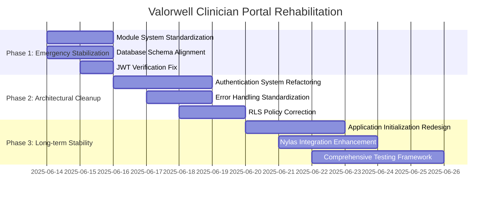

# Strategic Implementation Plan for Valorwell Clinician Portal Rehabilitation

## Executive Summary

This implementation plan addresses the critical issues preventing the Valorwell Clinician Portal from loading and functioning properly. The plan is organized into three phases: emergency stabilization, architectural cleanup, and long-term stability. Each phase targets specific root causes and provides actionable steps to resolve them.

## Phase 1: Emergency Stabilization (Immediate Fixes)

### 1.1 Module System Standardization

**Root Cause:** The application is mixing CommonJS (require) and ES Modules (import) in a Vite environment, causing module resolution failures.

**Implementation Steps:**
1. Standardize module imports in main.tsx:
   ```typescript
   // Replace this mixed approach:
   try {
     App = require('./App.tsx').default;
   } catch (error) {
     import('./App.tsx').then(module => {...})
   }
   
   // With consistent ES Module imports:
   import App from './App.tsx';
   ```

2. Remove emergency dynamic import fallbacks and replace with proper error boundaries.

3. Update tsconfig.json to enforce module consistency:
   ```json
   {
     "compilerOptions": {
       "module": "ESNext",
       "moduleResolution": "bundler",
       "allowImportingTsExtensions": false
     }
   }
   ```

**Verification:** The application should load without console errors related to module resolution.

### 1.2 Database Schema Alignment

**Root Cause:** The code is referencing a non-existent `client_id` column in the clients table, while the actual primary key is `id`.

**Implementation Steps:**
1. Update AuthProvider.tsx to use the correct column name:
   ```typescript
   // Replace:
   .eq('client_id', userId)
   
   // With:
   .eq('id', userId)
   ```

2. Audit all database queries in the application to ensure they use the correct column names.

3. Create a database view if needed to maintain backward compatibility:
   ```sql
   CREATE VIEW clients_compatibility AS
   SELECT id as client_id, * FROM clients;
   ```

**Verification:** Database queries should execute successfully without 404/406 errors.

### 1.3 JWT Verification Fix

**Root Cause:** The Nylas functions are failing to verify JWT tokens correctly, causing authentication failures.

**Implementation Steps:**
1. Update the Supabase function deployment to properly handle JWT verification:
   ```bash
   supabase functions deploy nylas-auth --no-verify-jwt
   ```

2. Modify the nylas-auth function to handle JWT verification internally:
   ```typescript
   // Add proper error handling for JWT verification
   const { data: { user }, error: authError } = await supabaseClient.auth.getUser()
   if (authError || !user) {
     // Detailed error logging and response
   }
   ```

3. Implement proper error handling for authentication failures.

**Verification:** Nylas authentication should work without JWT verification errors.

## Phase 2: Architectural Cleanup (Short-term Fixes)

### 2.1 Authentication System Refactoring

**Root Cause:** The authentication system has dual contexts, circular dependencies, and overly complex state management.

**Implementation Steps:**
1. Simplify the AuthProvider state management:
   ```typescript
   // Consolidate multiple state variables
   const [authState, setAuthState] = useState<{
     user: SupabaseUser | null;
     userRole: string | null;
     clientProfile: ClientProfile | null;
     isLoading: boolean;
     error: Error | null;
     state: 'loading' | 'authenticated' | 'unauthenticated' | 'error';
   }>({
     user: null,
     userRole: null,
     clientProfile: null,
     isLoading: true,
     error: null,
     state: 'loading'
   });
   ```

2. Create a clear separation between authentication logic and UI components:
   - Move all authentication logic to AuthProvider
   - Keep AuthWrapper focused on UI rendering based on auth state

3. Implement a proper authentication state machine to handle transitions more reliably.

**Verification:** The application should maintain authentication state correctly across page refreshes and navigation.

### 2.2 Error Handling Standardization

**Root Cause:** Inconsistent error boundary implementations across the application lead to unpredictable error handling.

**Implementation Steps:**
1. Create a unified ErrorBoundary component that all specialized boundaries extend:
   ```typescript
   // Base ErrorBoundary with common functionality
   class BaseErrorBoundary extends Component<BaseErrorBoundaryProps, ErrorBoundaryState> {
     // Common error handling logic
     
     // Reset functionality for all error boundaries
     handleReset = () => {
       this.setState({ hasError: false, error: undefined });
     };
   }
   
   // Specialized boundaries extend the base
   class CalendarErrorBoundary extends BaseErrorBoundary {
     // Calendar-specific error handling
   }
   ```

2. Standardize error reporting across all boundaries:
   - Consistent UI for error states
   - Common reset functionality
   - Proper error logging

3. Implement global error tracking to capture and report errors consistently.

**Verification:** Errors should be caught, displayed, and recoverable across all parts of the application.

### 2.3 RLS Policy Correction

**Root Cause:** Incorrect RLS policies are causing 406 errors when accessing database tables.

**Implementation Steps:**
1. Fix the clients table RLS policy:
   ```sql
   -- Update the policy to handle both id and user_id correctly
   CREATE POLICY "Users can access their own client record" ON clients
     FOR ALL USING (id = auth.uid() OR user_id = auth.uid());
   ```

2. Ensure all Nylas-related tables have proper RLS policies:
   ```sql
   -- Fix nylas_connections policy
   CREATE POLICY "Users can manage their own connections" ON nylas_connections
     FOR ALL USING (user_id = auth.uid());
   ```

3. Add proper grants for all tables:
   ```sql
   GRANT SELECT, INSERT, UPDATE, DELETE ON nylas_connections TO authenticated;
   ```

**Verification:** Database queries should execute without RLS policy violations.

## Phase 3: Long-term Stability (Sustainable Solutions)

### 3.1 Application Initialization Redesign

**Root Cause:** Complex dynamic imports and circular dependencies in the initialization process cause unpredictable loading behavior.

**Implementation Steps:**
1. Implement a proper application bootstrapping process:
   ```typescript
   // main.tsx - Clean initialization
   import React from 'react';
   import { createRoot } from 'react-dom/client';
   import App from './App';
   import './index.css';
   
   const rootElement = document.getElementById('root');
   if (!rootElement) {
     throw new Error('Root element not found');
   }
   
   const root = createRoot(rootElement);
   root.render(
     <React.StrictMode>
       <App />
     </React.StrictMode>
   );
   ```

2. Create a dedicated configuration module to handle environment variables:
   ```typescript
   // config.ts
   export const config = {
     supabase: {
       url: import.meta.env.VITE_SUPABASE_URL,
       anonKey: import.meta.env.VITE_SUPABASE_ANON_KEY,
     },
     nylas: {
       clientId: import.meta.env.VITE_NYLAS_CLIENT_ID,
       redirectUri: import.meta.env.VITE_NYLAS_REDIRECT_URI,
     },
     // Validate configuration
     validate() {
       if (!this.supabase.url || !this.supabase.anonKey) {
         throw new Error('Missing Supabase configuration');
       }
       return true;
     }
   };
   ```

3. Implement proper dependency injection to avoid circular dependencies.

**Verification:** The application should initialize cleanly without circular dependency warnings.

### 3.2 Nylas Integration Enhancement

**Root Cause:** The Nylas integration has issues with token refresh logic and error handling.

**Implementation Steps:**
1. Implement robust token refresh logic:
   ```typescript
   // Token refresh function
   async function refreshNylasToken(connectionId: string) {
     // Get the connection with refresh token
     const { data: connection } = await supabase
       .from('nylas_connections')
       .select('refresh_token')
       .eq('id', connectionId)
       .single();
       
     // Call Nylas token refresh endpoint
     const response = await fetch('https://api.us.nylas.com/v3/connect/token', {
       method: 'POST',
       headers: { 'Content-Type': 'application/json' },
       body: JSON.stringify({
         grant_type: 'refresh_token',
         refresh_token: connection.refresh_token,
         client_id: nylasClientId,
         client_secret: nylasClientSecret,
       }),
     });
     
     // Update the token in the database
     const tokenData = await response.json();
     await supabase
       .from('nylas_connections')
       .update({
         access_token: tokenData.access_token,
         refresh_token: tokenData.refresh_token,
         token_expires_at: new Date(Date.now() + (tokenData.expires_in * 1000)).toISOString(),
       })
       .eq('id', connectionId);
   }
   ```

2. Add proper error handling for Nylas API calls:
   - Implement retry logic for transient errors
   - Handle token expiration gracefully
   - Provide clear error messages to users

3. Create a Nylas service layer to encapsulate all Nylas-related functionality.

**Verification:** Calendar integration should work reliably with proper token refresh.

### 3.3 Comprehensive Testing Framework

**Root Cause:** Lack of systematic testing allows regressions and makes it difficult to verify fixes.

**Implementation Steps:**
1. Implement unit tests for critical components:
   ```typescript
   // Example test for AuthProvider
   test('AuthProvider handles authentication state correctly', async () => {
     // Test setup
     render(<AuthProvider><TestComponent /></AuthProvider>);
     
     // Test authentication flow
     await act(async () => {
       // Simulate login
     });
     
     // Verify state
     expect(screen.getByText('authenticated')).toBeInTheDocument();
   });
   ```

2. Create integration tests for key workflows:
   - Authentication flow
   - Calendar integration
   - Error handling

3. Implement end-to-end tests for critical user journeys.

**Verification:** All tests should pass, providing confidence in the application's stability.

## Implementation Timeline



## Risk Assessment and Mitigation

| Risk | Impact | Likelihood | Mitigation |
|------|--------|------------|------------|
| Breaking changes to authentication | High | Medium | Implement changes incrementally with fallbacks |
| Database schema changes affecting existing data | High | Low | Create compatibility views and validate all queries |
| Nylas API changes | Medium | Low | Add version checking and graceful degradation |
| Environment configuration issues | Medium | Medium | Implement robust config validation and defaults |
| Circular dependencies reintroduced | Medium | Medium | Enforce architecture reviews and dependency analysis |

## Conclusion

This implementation plan addresses the root causes of the issues preventing the Valorwell Clinician Portal from functioning properly. By following the phased approach, we can quickly stabilize the application while building toward long-term stability and maintainability.

The plan prioritizes fixes based on their impact on application functionality, starting with critical issues that prevent the application from loading, then addressing architectural issues that cause instability, and finally implementing long-term solutions for sustainable development.

Each fix includes specific, actionable steps and verification methods to ensure the changes effectively address the root causes of the issues.