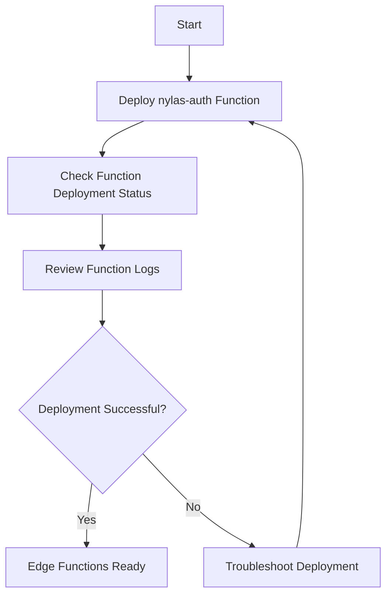
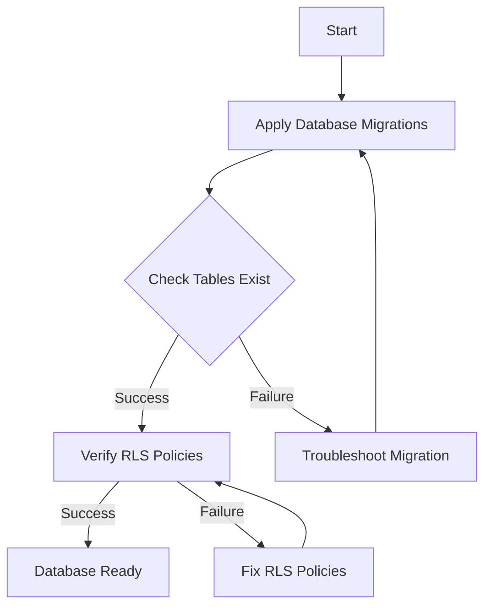
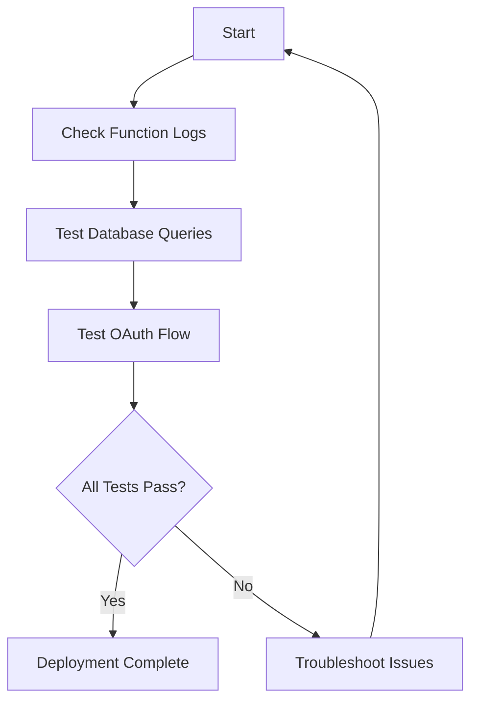

# Nylas Integration Deployment Plan

## Current Issues Analysis

1. **Edge Function Issues (400 Errors)**
   - Edge functions not properly deployed
   - Need to deploy functions with proper configuration

2. **Database Issues (406 Errors)**
   - Missing tables: `nylas_connections` and `nylas_scheduler_configs`
   - Incorrect RLS policies causing permission errors
   - Need to apply migrations to create tables and fix policies

## Deployment Plan

### Phase 1: Edge Function Deployment



1. **Deploy Edge Functions**
   - Deploy the nylas-auth function:
     ```bash
     supabase functions deploy nylas-auth
     ```
   - Optionally deploy other related functions:
     ```bash
     supabase functions deploy nylas-events
     supabase functions deploy nylas-sync-appointments
     supabase functions deploy nylas-scheduler-config
     ```

2. **Verify Edge Function Deployment**
   - Check function deployment status:
     ```bash
     supabase functions list
     ```
   - Review function logs:
     ```bash
     supabase functions logs nylas-auth
     ```
   - Look for any deployment issues or runtime errors

### Phase 2: Database Migration



1. **Apply Database Migrations**
   - Run `supabase db push` to apply all pending migrations
   - This will create the necessary tables and set up RLS policies
   - Key migrations: 
     - `20240615000001_run_nylas_migrations.sql` (creates tables)
     - `20240615000003_fix_rls_policies.sql` (fixes initial RLS issues)
     - `20240615000006_fix_nylas_rls_final.sql` (comprehensive RLS fix)

2. **Verify Database Setup**
   - Run SQL queries to check if tables exist:
     ```sql
     SELECT * FROM nylas_connections LIMIT 1;
     SELECT * FROM nylas_scheduler_configs LIMIT 1;
     ```
   - Ensure no 406 errors occur during these queries

### Phase 3: Verification and Testing



1. **Test Edge Function**
   - Review function logs:
     ```bash
     supabase functions logs nylas-auth
     ```
   - Test the function endpoint manually if possible

2. **Test Database Access**
   - Run queries to verify tables exist and RLS policies work:
     ```sql
     SELECT * FROM nylas_connections LIMIT 1;
     SELECT * FROM nylas_scheduler_configs LIMIT 1;
     ```
   - Verify no 406 errors occur

3. **Test OAuth Flow**
   - Navigate to the calendar page in the application
   - Attempt to connect a calendar
   - Verify the OAuth flow works correctly

## Troubleshooting Guide

### For 400 Edge Function Errors
1. Check if all required secrets are configured
2. Review function logs for specific error messages
3. Verify the function is properly deployed
4. Test the function endpoint manually

### For 406 Database Errors
1. Check if tables exist in the database
2. Verify RLS policies are correctly applied
3. Ensure authenticated users have proper permissions
4. Run the debug auth context function to check authentication:
   ```sql
   SELECT * FROM debug_auth_context();
   ```

## Expected Outcomes

After successful deployment:
- Edge functions will work without 400 errors
- Database queries will work without 406 errors
- Calendar integration will function properly
- Users will be able to connect their calendars via OAuth